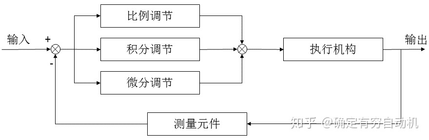
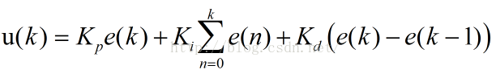
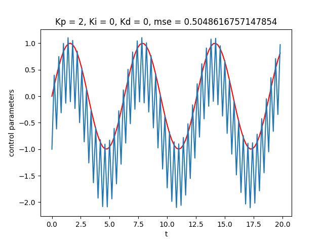
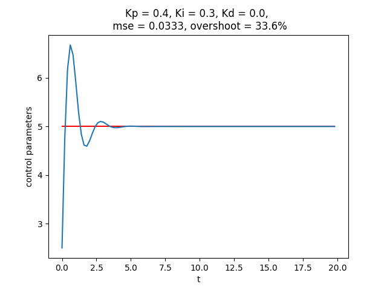
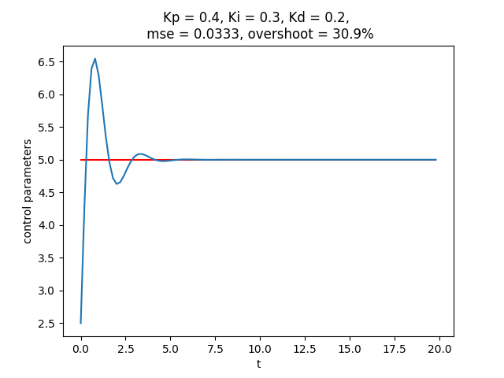

# PID 控制

任何闭环控制系统的首要任务是要快速、准确、稳定地响应命令，PID参数调整就是实现这一目的，其中P对应快速，I对应准确，D对应稳定。增大比例系数P能加快系统响应，但不能稳定在理想数值。积分在比例的基础上消除稳态误差。微分有**超前作用**，可以使系统超调量减小，稳定性增加，动态误差减小。

综上P—比例控制系统的**响应快速性**，I—积分控制系统的**准确性**，D—微分控制系统的**稳定性**。

## 一、控制参数

合理选择PID调节器的参数，即比例系数KP、积分时间常数Ti和微分时间常数TD，可以达到良好的控制效果。

 

总的来说，当得到系统的输出后，将输出经过比例，积分，微分3种运算方式，叠加到输入中，从而控制系统的行为。最终数字信号控制还需将其离散化成如下形式：

## 三、结果

### a. 比例控制

考虑一个正弦波控制信号，存在1.0稳态误差，在仅有比例控制的情况下，波形如下所示：

当增大Kp可以减少稳态误差，但继续增大曲线会发生震荡甚至发散。

**结论**：比例控制无法完全消除稳态误差，比例系数增大可以减小稳态误差，但太大会引起系统震荡，不稳定。

### b. 积分控制

引入积分控制后可以消除稳态误差，但会导致超调，如下图所示。超调 = (最大输出值 - 稳态值) / 稳态值 * 100%，是衡量调节品质的一个量，超调并不一定都是有害的。衡量调节品质的另一个量是稳态时间，即达到稳定状态(误差2%)的时间，超调和稳态时间是矛盾的。超调越大稳态时间越短，实际应用需要权衡。

**结论**: 引入积分控制可以消除稳态误差，但会增加超调，且随着Ki的增大，超调量也增大。

### C. 微分控制

引入微分控制可以减弱超调趋势，当Kd参数过大时也会造成系统震荡。

## 四、参考资料

[1] [知乎-PID控制](https://zhuanlan.zhihu.com/p/39573490)

[2] [CSDN-超调](https://blog.csdn.net/h_kingone/article/details/72452815)

